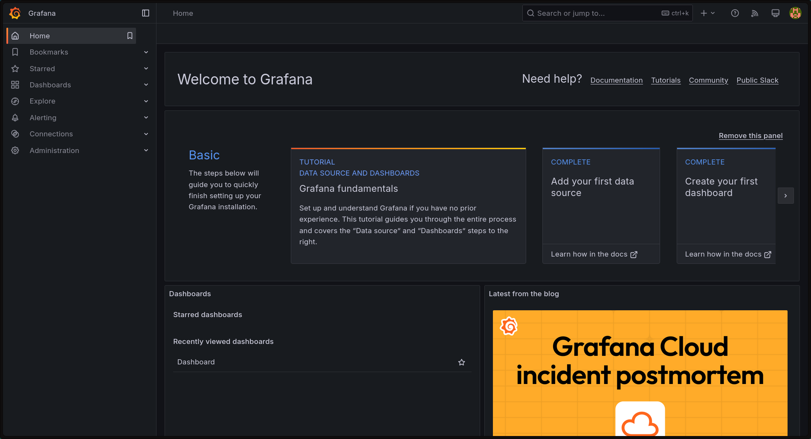

# Vex Service Research

This is a research branch which provides an example deployment configuration
that ships basic Python and Go HTTP API servers inside a
[Kubernetes cluster](https://kubernetes.io/docs/concepts/architecture/) as well
as a guide to monitoring these applications using the
[kube-prometheus](https://github.com/prometheus-operator/kube-prometheus) stack
with [Prometheus](https://prometheus.io/) and [Grafana](https://grafana.com/).

The contents of this branch are not necessarily in sync with the default branch
and exist mainly for testing purposes.

## Get started

### Setup a cluster

You will need a Kubernetes cluster. It is best to configure
[kubelet](https://kubernetes.io/docs/reference/command-line-tools-reference/kubelet/)
to use token authentication and authorization as it allows to give Prometheus
access to metrics only instead of full access to kubelet. You can use
[minikube](https://github.com/kubernetes/minikube) with the following command
to create a cluster on your local machine:

```shell
$ minikube delete && minikube start --kubernetes-version=v1.23.0 --memory=6g --bootstrapper=kubeadm --extra-config=kubelet.authentication-token-webhook=true --extra-config=kubelet.authorization-mode=Webhook --extra-config=scheduler.bind-address=0.0.0.0 --extra-config=controller-manager.bind-address=0.0.0.0
```

See [kube-prometheus](https://github.com/prometheus-operator/kube-prometheus/tree/main?tab=readme-ov-file#prerequisites)
repository for details on prerequisites.

### Deploy the monitoring stack

We will use configurations from [ModernCode monitoring infrastructure](https://github.com/moderncode-source/mon-infra)
to get up and running quickly. Having checked-out the repository, apply the
generated [manifests](https://github.com/moderncode-source/mon-infra/tree/main/lib/kube-prometheus/manifests)
to create the monitoring stack:

```shell
# Create the namespace and CRDs, and the remaining resources afterwards.
# If the server-side apply feature is not available, use kubectl create.
kubectl apply --server-side -f lib/kube-prometheus/manifests/setup
kubectl wait \
	--for condition=Established \
	--all CustomResourceDefinition \
	--namespace=mon
kubectl apply -f lib/kube-prometheus/manifests/
```

Confirm that monitoring resources were successfully created by running the
command below. Output should be similar.

```shell
kubectl -n mon get svc -o go-template='{{range .items}}{{.metadata.name}}{{"\n"}}{{end}}'

grafana
kube-state-metrics
prometheus-k8s
prometheus-operated
prometheus-operator
```

### Deploy hello-world servers

At this point, checkout this branch and create Go and Python application resources with:

```shell
kubectl apply -f deploy/go -f deploy/python
```

And verify that those were created successfully:

```shell
kubectl -n default get pods

NAME                          READY   STATUS    RESTARTS   AGE
go-app-7f8d6ccd69-xs4xn       1/1     Running   0          7h6m
python-app-7697dc984b-p2cxm   1/1     Running   0          7h6
```

## Access deployed applications

You can access pod's port through a local port using
[port-forwarding](https://kubernetes.io/docs/tasks/access-application-cluster/port-forward-access-application-cluster/).

Let's port-forward Grafana to `localhost:3000` to be able to access it via your favorite browser:

```shell
kubectl port-forward -n mon svc/grafana 3000:3000
```

Unless you changed the default credentials, log into Grafana with username `admin` and password `admin`. You should now see a window that is similar to this one:



Similarly, you can port-forward Go and Python apps. In this guide, we will apply HTTP traffic and load to these servers externally:

```shell
kubectl port-forward -n default svc/go-app 8080:8080
kubectl port-forward -n default svc/python-app 8081:8080
```

By visiting `localhost:8080` or `localhost:8081`, you should receive a `Hello World` response with status code `200`:

```shell
curl -X GET localhost:8080 -i

HTTP/1.1 200 OK
Date: Sun, 16 Mar 2025 20:37:45 GMT
Content-Length: 13
Content-Type: text/plain; charset=utf-8

Hello world!
```

## Load-testing Go and Python servers

We will use the [hey](https://github.com/rakyll/hey) command to generate a
moderate load for around 30 minutes to determine the baseline performance of the most basic Go and Python API servers.

```shell
hey -z 30m -m GET http://localhost:8080 & hey -z 30m -m GET http://localhost:8081 & wait
```

Using [this dashboard](https://github.com/moderncode-source/mon-infra/blob/main/dashboards/grafana/0-pods-cpu-and-memory-testing.json),
I observed the following results in Grafana:


As we can see, the server written in Go using its standard [`net/http`](https://pkg.go.dev/net/http)
library has a smaller memory footprint peaking at around 16MiB with 7% CPU usage at the highest.
The Python app, using [FastAPI](https://fastapi.tiangolo.com/), was consuming
stable 45MiB of RAM and CPU peaking at 12%.

And here is the output from `hey`. Go, on port `8080`, was
able to process 1470 request per second on average with 0.06s response latency
at 99% percentile. Python, port-forwarded to port `8081`, processed 642 req/s
with 0.1477s latency at 99% percentile. Note that the servers were not
stress-tested here, but almost idle resource consumption was measured instead.

```txt
Summary:
  Total:        1800.0377 secs
  Slowest:      0.5261 secs
  Fastest:      0.0012 secs
  Average:      0.0900 secs
  Requests/sec: 1469.5553

  Total data:   34388315 bytes
  Size/request: 34 bytes

Response time histogram:
  0.001 [1]     |
  0.054 [963362]        |■■■■■■■■■■■■■■■■■■■■■■■■■■■■■■■■■■■■■■■■
  0.106 [36381] |■■
  0.159 [117]   |
  0.211 [10]    |
  0.264 [49]    |
  0.316 [31]    |
  0.369 [35]    |
  0.421 [7]     |
  0.474 [2]     |
  0.526 [5]     |


Latency distribution:
  10% in 0.0112 secs
  25% in 0.0258 secs
  50% in 0.0333 secs
  75% in 0.0403 secs
  90% in 0.0469 secs
  95% in 0.0515 secs
  99% in 0.0633 secs

Details (average, fastest, slowest):
  DNS+dialup:   0.0000 secs, 0.0012 secs, 0.5261 secs
  DNS-lookup:   0.0000 secs, 0.0000 secs, 0.0154 secs
  req write:    0.0001 secs, 0.0000 secs, 0.0160 secs
  resp wait:    0.0896 secs, 0.0011 secs, 0.5259 secs
  resp read:    0.0002 secs, 0.0000 secs, 0.0138 secs

Status code distribution:
  [200] 1000000 responses


[1]  - 230299 done       hey -z 30m -m GET http://localhost:8080

Summary:
  Total:        1800.1003 secs
  Slowest:      0.7328 secs
  Fastest:      0.0034 secs
  Average:      0.0900 secs
  Requests/sec: 641.9992

  Total data:   12712293 bytes
  Size/request: 12 bytes

Response time histogram:
  0.003 [1]     |
  0.076 [471655]        |■■■■■■■■■■■■■■■■■■■■■■■■■■■■■■■■■■■■
  0.149 [519666]        |■■■■■■■■■■■■■■■■■■■■■■■■■■■■■■■■■■■■■■■■
  0.222 [8571]  |■
  0.295 [20]    |
  0.368 [27]    |
  0.441 [27]    |
  0.514 [13]    |
  0.587 [17]    |
  0.660 [2]     |
  0.733 [1]     |


Latency distribution:
  10% in 0.0193 secs
  25% in 0.0246 secs
  50% in 0.0955 secs
  75% in 0.1140 secs
  90% in 0.1241 secs
  95% in 0.1309 secs
  99% in 0.1477 secs

Details (average, fastest, slowest):
  DNS+dialup:   0.0000 secs, 0.0034 secs, 0.7328 secs
  DNS-lookup:   0.0000 secs, 0.0000 secs, 0.0073 secs
  req write:    0.0000 secs, 0.0000 secs, 0.0168 secs
  resp wait:    0.0898 secs, 0.0034 secs, 0.7224 secs
  resp read:    0.0001 secs, 0.0000 secs, 0.0159 secs

Status code distribution:
  [200] 1000000 responses


[2]  + 230300 done       hey -z 30m -m GET http://localhost:8081
```

## Cleanup

- Delete Go and Python application resources from the directory this branch is checked-out into:

```shell
kubectl delete -f deploy/go -f deploy/python
```

- Tear-down the monitoring stack from the [mon-infra](https://github.com/moderncode-source/mon-infra) repo:

```shell
kubectl delete --ignore-not-found=true -f lib/kube-prometheus/manifests/ -f lib/kube-prometheus/manifests/setup
```

## License

Vex was written by Kiril Strezikozin <kirilstrezikozin@gmail.com>, copyright
2025, distributed and available under the terms of either the Apache-2.0 or
MIT license at your choice.
